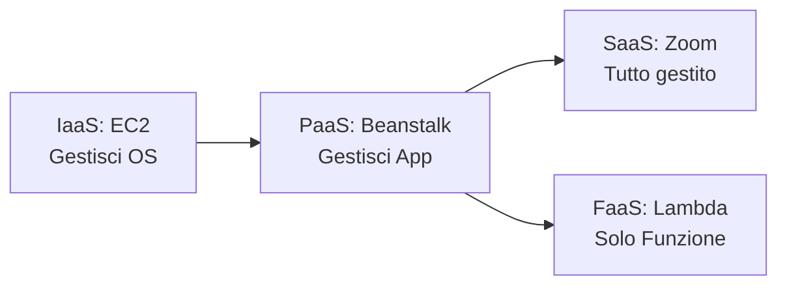
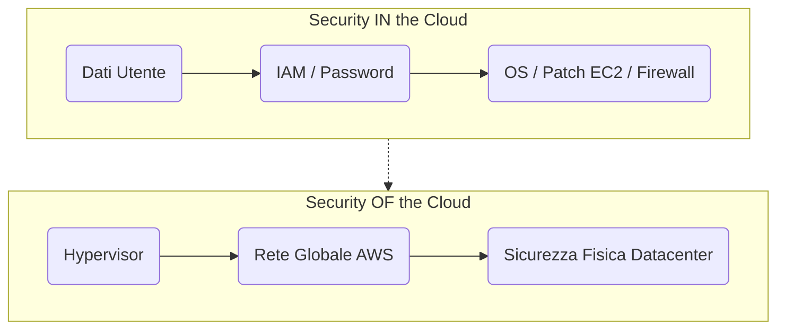

# 🚀 AWS Cloud Practitioner (CLF-C02) - L'Enciclopedia Definitiva

Questo cheat sheet esteso contiene la totalità dei servizi e dei concetti coperti dall'esame CLF-C02, suddivisi per Dominio. Perfetto per il ripasso finale.

---

## ☁️ DOMINIO 1: Concetti Base del Cloud (Cloud Concepts)

### 1.1 Definizioni Fondamentali
*   **Cloud Computing:** Fornitura on-demand di risorse IT tramite Internet con prezzi in base al consumo (pay-as-you-go).
*   **CapEx vs OpEx:** Il Cloud trasforma le spese in conto capitale (CapEx - comprare server fisici) in spese operative (OpEx - pagare solo ciò che si usa).
*   **High Availability (Alta Affidabilità):** Il sistema funziona senza interruzioni per lunghi periodi (es. architettura Multi-AZ).
*   **Fault Tolerance (Tolleranza ai guasti):** Capacità di un sistema di continuare a funzionare *anche* se un componente si rompe.
*   **Scalability (Scalabilità):** Adattarsi al carico. *Verticale (Scale Up):* Aggiungere RAM/CPU a un server. *Orizzontale (Scale Out):* Aggiungere più server.
*   **Elasticity (Elasticità):** La capacità del cloud di scalare in automatico *sia verso l'alto che verso il basso* (es. Auto Scaling) a seconda della domanda istantanea.

### 1.2 I Modelli di Servizio (IaaS, PaaS, SaaS, FaaS)

*   **IaaS (Infrastructure as a Service):** *Es. Amazon EC2.* Ti danno l'hardware virtuale. Tu gestisci OS, database e app.
*   **PaaS (Platform as a Service):** *Es. Elastic Beanstalk.* Tu scrivi solo il codice. AWS gestisce l'infrastruttura, il server e il sistema operativo.
*   **SaaS (Software as a Service):** *Es. Gmail, Zoom.* Software pronto all'uso gestito interamente dal fornitore.
*   **FaaS (Function as a Service / Serverless):** *Es. AWS Lambda.* Esegui singole porzioni di codice a evento, pagando solo i millisecondi di esecuzione. Nessun server da gestire.

### 1.3 Modelli di Distribuzione (Deployment Models)
*   **Public Cloud:** Tutto gira sui server di AWS.
*   **Private Cloud (On-Premises):** Server fisici nel tuo datacenter aziendale.
*   **Hybrid Cloud:** Un mix tra Public e Private (connessi via Direct Connect o VPN).

### 1.4 AWS Cloud Adoption Framework (CAF) e Migrazione
I 6 Pilastri (Prospettive) per adottare il Cloud:
*   **Business Capabilities:** *Business, People, Governance.*
*   **Technical Capabilities:** *Platform, Security, Operations.*
*   **Le 6 R della Migrazione:** 
    1) *Rehost* (Lift & Shift - sposta così com'è).
    2) *Replatform* (Lift, tinker & shift - sposta e ottimizza un po', es. verso RDS).
    3) *Refactor/Re-architect* (Riscrivi il codice per il cloud nativo).
    4) *Repurchase* (Passa a un SaaS).
    5) *Retain* (Tieni on-premise per ora).
    6) *Retire* (Spegni il server inutile).

---

## 🔒 DOMINIO 2: Security & Compliance

### 2.1 Shared Responsibility Model (Chi fa cosa?)

*   **Security OF the Cloud (AWS):** Sicurezza FISICA. (I datacenter, l'hardware, i cavi, il software che gestisce la virtualizzazione).
*   **Security IN the Cloud (Tu/Cliente):** Sicurezza LOGICA. (I tuoi dati, password IAM, aprire porte sul firewall di rete VPC, aggiornare l'antivirus su EC2, crittografare i file).

### 2.2 Servizi di Sicurezza e Identità
*   **AWS IAM:** Gestione utenti, gruppi, ruoli (per dare permessi alle istanze EC2) e policy (JSON). MFA obbligatoria per il Root User.
*   **AWS IAM Identity Center:** (Ex SSO) Login unico per molti account aziendali.
*   **AWS WAF:** Web Application Firewall. Ferma attacchi Layer 7 (SQL injection, XSS).
*   **AWS Shield:** Blocca attacchi DDoS Layer 3/4. Lo *Standard* è gratis e automatico.
*   **AWS KMS:** Crea e gestisce chiavi per criptare dischi EBS o S3.
*   **AWS CloudHSM:** Come KMS, ma su hardware fisico dedicato.
*   **AWS Secrets Manager:** Salva e *ruota* in automatico le password dei DB.
*   **Amazon Macie:** Intelligenza Artificiale per scovare carte di credito o PII in Amazon S3.
*   **Amazon GuardDuty:** Rilevamento minacce intelligente basato sui log (es. login anomali da paesi strani).
*   **Amazon Inspector:** Scansiona le tue macchine virtuali EC2 per vulnerabilità software.
*   **AWS Artifact:** Portale per scaricare PDF dei report legali e certificazioni ISO/SOC di AWS.
*   **Amazon Cognito:** Sistema di registrazione/login per gli utenti delle tue app web.

---

## 🏗️ DOMINIO 3: Technology and Services

### 3.1 Architettura Globale
*   **Region:** Area geografica isolata (es. eu-south-1). Composta da minimo 3 AZ.
*   **Availability Zone (AZ):** Uno o più datacenter separati fisicamente per resistere ai disastri.
*   **Edge Location:** Mini-datacenter periferici per servire contenuti velocemente (CloudFront).
*   *Servizi Globali:* IAM, Route 53, CloudFront, WAF.
*   *Servizi Regionali:* EC2, S3 (nome globale ma file locali), RDS, VPC.

### 3.2 Compute (Calcolo)
*   **Amazon EC2:** Server virtuale (IaaS).
*   **AWS Lambda:** Serverless / FaaS.
*   **Amazon ECS / EKS:** Container (Docker / Kubernetes). **Fargate:** Esegui container senza server.
*   **Amazon Lightsail:** VPS per principianti a costo fisso mensile.
*   **AWS Batch:** Elaborazione massiva asincrona.

### 3.3 Storage
*   **Amazon S3:** Object storage (static web hosting, backup). Classi: *Standard*, *IA* (Infrequent Access), *Glacier* (Archiviazione economica, recupero lento), *Intelligent-Tiering* (Automatico).
*   **Amazon EBS:** Block storage (Disco primario per EC2).
*   **Amazon EFS:** File system condiviso per istanze Linux.
*   **Amazon FSx:** File system nativo per macchine Windows o HPC.
*   **AWS Storage Gateway:** Cloud Ibrido per i dischi locali.
*   **Snow Family:** Valigie fisiche per spostare Petabyte di dati off-line.

### 3.4 Database
*   **Amazon RDS:** Database relazionale (SQL) gestito. Backup e patch automatici. **Aurora:** Più veloce e costoso.
*   **Amazon DynamoDB:** Database NoSQL. Latenza ms, scala all'infinito.
*   **Amazon Redshift:** Data Warehouse per Analytics e Big Data.
*   **Amazon ElastiCache:** Caching in-memory (Redis/Memcached).
*   **Amazon Neptune / DocumentDB / QLDB:** Grafi / Compatibile MongoDB / Registro immutabile (Ledger).

### 3.5 Networking & Content Delivery
*   **Amazon VPC:** Rete privata virtuale. (Subnet pubbliche hanno Internet Gateway, le private usano NAT Gateway).
*   **Amazon Route 53:** Servizio DNS (Porta 53).
*   **Amazon CloudFront:** CDN globale.
*   **AWS Direct Connect:** Cavo fisico privato ufficio-AWS.
*   **AWS Transit Gateway:** Hub centrale per connettere tra loro decine di VPC e reti on-premise.
*   **AWS Global Accelerator:** Invia il tuo traffico sulla rete in fibra privata di AWS per azzerare la latenza.

### 3.6 Management, Governance & Analytics
*   **Amazon CloudWatch:** **Performance** (CPU, allarmi).
*   **AWS CloudTrail:** **Sicurezza e Auditing** (Chi ha fatto quale chiamata API?).
*   **AWS Trusted Advisor:** Valuta il tuo account su 5 pilastri (Sicurezza, Costi, Performance, Fault Tolerance, Limiti).
*   **AWS CloudFormation:** Infrastructure as Code (Templates YAML).
*   **Amazon Athena:** Fai query SQL direttamente sui file di testo in S3.
*   **Amazon Kinesis / EMR / QuickSight:** Streaming in tempo reale / Big Data Hadoop / Grafici e Business Intelligence.
*   **Machine Learning:** SageMaker (Creare modelli AI), Rekognition (Immagini), Polly (Testo a Voce), Comprehend (Analisi sentimenti).

---

## 💸 DOMINIO 4: Billing, Pricing & Support

### 4.1 Modelli di Prezzo (Pricing Models)
*   **On-Demand:** Paghi al secondo. Costoso ma zero impegno. (Ideale per test o app spiky).
*   **Reserved Instances / Savings Plans:** Impegno di 1 o 3 anni. Sconto massimo (-72%). (Ideale per database sempre accesi).
*   **Spot Instances:** Aste per server invenduti. Sconto estremo (-90%) ma AWS può spegnerlo in 2 minuti. (Ideale per task in background).
*   **Dedicated Hosts:** Server fisico intero solo per te. (Per questioni di licenze software vecchie o altissima compliance).

### 4.2 Strumenti per i Costi
*   **AWS Organizations:** Unisce account. **Consolidated Billing** (Fattura unica) e sconti per volume d'uso totale. Permette le SCP (Service Control Policies) per vietare l'uso di servizi a tutti.
*   **AWS Pricing Calculator:** Fai un preventivo online *prima* di creare qualcosa.
*   **AWS Cost Explorer:** Grafici colorati su cosa hai speso e previsioni per i prossimi 12 mesi.
*   **AWS Budgets:** Imposti un budget (es. $100). Ti invia una mail all'80%.

### 4.3 Support Plans (I 4 Piani)
*   **Basic:** Gratuito. Supporto solo per fatturazione, no tecnico. Solo 7 controlli base su Trusted Advisor.
*   **Developer:** Comunicazione via Email in orario d'ufficio.
*   **Business:** Supporto tecnico 24/7 (Telefono, Chat, Email). Accesso *completo* a tutti i controlli Trusted Advisor.
*   **Enterprise:** Tutto il resto + un **TAM (Technical Account Manager)** dedicato + tempo di risposta 15 minuti sui guasti critici. Riservato alle multinazionali.

---

## 🏛️ APPENDICE: AWS Well-Architected Framework (I 6 Pilastri)
I 6 pilastri fondamentali per progettare bene nel Cloud:
1.  **Operational Excellence:** Automazione (Infrastructure as Code).
2.  **Security:** IAM, Least Privilege, Protezione dati in transito/riposo.
3.  **Reliability (Affidabilità):** Auto Scaling, recupero automatico.
4.  **Performance Efficiency:** Usare architetture Serverless e Globali.
5.  **Cost Optimization:** Spegnere le istanze non usate.
6.  **Sustainability:** Scegliere hardware efficiente per ridurre l'impatto sul clima.
