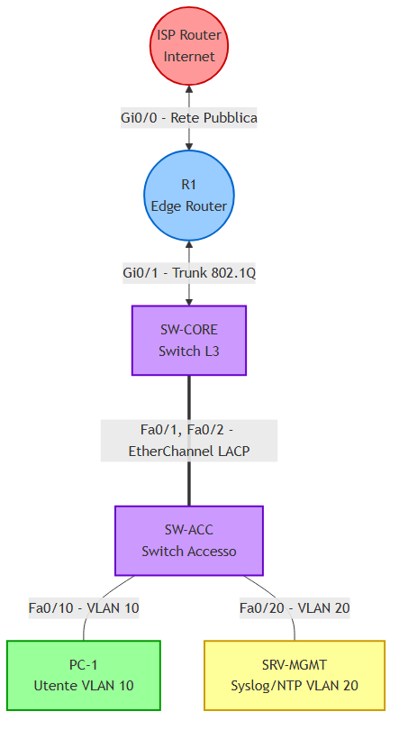

# Mega Lab CCNA: Consolidamento Totale "Sede Sorint"

> **OBIETTIVO:**
> Il presente laboratorio ha lo scopo di documentare e implementare un'infrastruttura di rete aziendale completa, integrando i protocolli di Layer 2, Layer 3, i Servizi IP e le policy di Sicurezza richieste dagli standard CCNA.

## Descrizione Architetturale
L'infrastruttura simulata riproduce un ambiente aziendale strutturato, implementando i seguenti moduli:

1. **Infrastruttura Layer 2:** Segmentazione logica del traffico tramite VLAN (VLAN 10 per gli utenti, VLAN 20 per i server). Implementazione della ridondanza fisica e logica tramite aggregazione dei link (**EtherChannel LACP**) e ottimizzazione del protocollo **STP** mediante elezione statica del Root Bridge.
2. **Infrastruttura Layer 3:** Configurazione del routing inter-VLAN tramite architettura **Router-on-a-Stick**. Implementazione del protocollo di routing dinamico **OSPF** per l'annuncio delle reti locali e la propagazione della rotta di default verso l'esterno.
3. **Servizi di Rete (NAT & DHCP):** Attivazione del servizio **DHCP** per l'assegnazione dinamica degli indirizzi IP agli host interni. Configurazione del **NAT (PAT Overload)** per consentire l'accesso a Internet mediante la traduzione degli indirizzi privati in un singolo indirizzo pubblico.
4. **Sicurezza e Monitoraggio:** Sincronizzazione temporale dell'infrastruttura tramite **NTP** e centralizzazione della reportistica degli eventi di sistema tramite **Syslog**, in conformità con le best practice operative (SNOC).

## 1. Topologia di Rete

Di seguito è riportato lo schema logico della rete. Si richiede di replicare la topologia su ambiente di simulazione (PNETLab o Cisco Packet Tracer), rispettando l'assegnazione delle interfacce.



> **IMPORTANTE - Cablaggio Cruciale:** Assicurati di usare due cavi separati tra `SW-CORE` e `SW-ACC` sulle porte `Fa0/1` e `Fa0/2` per poter configurare correttamente l'EtherChannel!

---

## 2. Tabella di Indirizzamento IP

Usa questa tabella come riferimento unico per assegnare gli indirizzi IP durante il lab.

| Dispositivo | Interfaccia / VLAN | Indirizzo IP | Subnet Mask | Gateway (Next Hop) |
| :--- | :--- | :--- | :--- | :--- |
| **R1** | `Gi0/0` (Verso ISP) | `203.0.113.2` | `255.255.255.252` | `203.0.113.1` (Default) |
| **R1** | `Gi0/1.10` (VLAN 10) | `192.168.10.254` | `255.255.255.0` | N/A |
| **R1** | `Gi0/1.20` (VLAN 20) | `192.168.20.254` | `255.255.255.0` | N/A |
| **PC-1** | NIC (VLAN 10) | *DHCP* | *DHCP* | *DHCP* |
| **SRV-MGMT**| NIC (VLAN 20) | `192.168.20.100` | `255.255.255.0` | `192.168.20.254` |
| **ISP** | `Gi0/0` (Verso R1) | `203.0.113.1` | `255.255.255.252` | N/A |

---

## Step 1: Layer 2 (VLAN, Trunk e EtherChannel)

Configurazione dell'infrastruttura di commutazione locale. Le VLAN garantiscono l'isolamento dei domini di broadcast, mentre l'EtherChannel fornisce ridondanza e incremento della larghezza di banda.

> **NOTA:**  
> I seguenti comandi devono essere eseguiti su entrambi gli switch di rete (`SW-CORE` e `SW-ACC`):

```text
enable
configure terminal

! 1. Creazione delle VLAN
vlan 10
 name DATI_UTENTI
vlan 20
 name MANAGEMENT
exit

! 2. Creazione EtherChannel (LACP) tra gli switch
interface range FastEthernet 0/1 - 2
 channel-group 1 mode active
 exit

! 3. Configurazione del Trunk sul canale aggregato
interface Port-channel 1
 switchport mode trunk
 switchport nonegotiate
 switchport trunk allowed vlan 10,20
 exit
```

> **ATTENZIONE:**  
> I seguenti comandi sono destinati esclusivamente allo switch di distribuzione (`SW-CORE`):

```text
! Porta verso the Router R1
interface GigabitEthernet 0/1
 switchport mode trunk
 switchport nonegotiate
 switchport trunk allowed vlan 10,20
 exit

! SW-CORE deve essere il Root Bridge per evitare cicli
spanning-tree vlan 10,20 root primary
```

> **NOTA:**  
> I seguenti comandi sono destinati esclusivamente allo switch di accesso (`SW-ACC`):

```text
! Configurazione porta PC con Port Security
interface FastEthernet 0/10
 switchport mode access
 switchport access vlan 10
 spanning-tree portfast
 switchport port-security
 switchport port-security maximum 2
 switchport port-security violation restrict
 switchport port-security mac-address sticky
 exit

! Configurazione porta Server
interface FastEthernet 0/20
 switchport mode access
 switchport access vlan 20
 spanning-tree portfast
 exit
```

---

## Step 2: Layer 3 (Routing Inter-VLAN e OSPF)

Implementazione del routing inter-VLAN tramite architettura **Router-on-a-Stick** e configurazione dell'accesso alla rete geografica tramite protocollo OSPF.

> **IMPORTANTE:**  
> Le configurazioni descritte in questa sezione devono essere applicate al router di frontiera **R1**.

```text
enable
configure terminal

! Accendiamo l'interfaccia fisica verso lo switch
interface GigabitEthernet 0/1
 no shutdown
 exit

! Sub-interface per la VLAN 10 (Utenti)
interface GigabitEthernet 0/1.10
 encapsulation dot1Q 10
 ip address 192.168.10.254 255.255.255.0
 exit

! Sub-interface per la VLAN 20 (Management)
interface GigabitEthernet 0/1.20
 encapsulation dot1Q 20
 ip address 192.168.20.254 255.255.255.0
 exit

! Interfaccia esterna (Verso l'ISP)
interface GigabitEthernet 0/0
 ip address 203.0.113.2 255.255.255.252
 no shutdown
 exit

! Configurazione OSPF e Rotta di Default
router ospf 1
 ! Sicurezza: Evitiamo di inviare messaggi OSPF verso le LAN
 passive-interface GigabitEthernet 0/1.10
 passive-interface GigabitEthernet 0/1.20
 ! Annunciamo le nostre reti locali
 network 192.168.10.0 0.0.0.255 area 0
 network 192.168.20.0 0.0.0.255 area 0
 ! Iniettiamo la rotta di default nel dominio OSPF
 default-information originate
 exit

! Rotta statica globale per uscire su Internet
ip route 0.0.0.0 0.0.0.0 203.0.113.1
```

> **NOTA:**
> **Configurazione Router ISP (Simulazione Internet):**
> L'ISP ha bisogno di un indirizzo IP, una loopback per simulare Google (`8.8.8.8`) e, fondamentale, **una rotta di ritorno** verso i nostri IP pubblici NAT!

```text
! Sul Router ISP
enable
configure terminal
interface GigabitEthernet 0/0
 ip address 203.0.113.1 255.255.255.252
 no shutdown
 exit

! Loopback per simulare un sito Internet
interface loopback 0
 ip address 8.8.8.8 255.255.255.255
 exit

! La "Rotta di Ritorno" vitale per evitare i ping in Timeout!
ip route 0.0.0.0 0.0.0.0 203.0.113.2
```

---

## Step 3: IP Services (DHCP e NAT Overload)

Configurazione dell'assegnazione dinamica degli indirizzi IP per gli end-device e abilitazione della Network Address Translation (PAT) per la connettività esterna.

> **NOTA:**  
> I comandi devono essere eseguiti sul router **R1**.

```text
! 1. Definizione di quali interfacce sono "Dentro" e quali "Fuori"
interface GigabitEthernet 0/1.10
 ip nat inside
 exit
interface GigabitEthernet 0/1.20
 ip nat inside
 exit
interface GigabitEthernet 0/0
 ip nat outside
 exit

! 2. Creazione dell'Access-List per il NAT (Quali IP possono navigare?)
access-list 1 permit 192.168.10.0 0.0.0.255
access-list 1 permit 192.168.20.0 0.0.0.255

! 3. Abilitazione del PAT (Port Address Translation) sull'interfaccia esterna
ip nat inside source list 1 interface GigabitEthernet 0/0 overload

! 4. Configurazione del DHCP Server per i dipendenti (VLAN 10)
ip dhcp excluded-address 192.168.10.254
ip dhcp pool POOL_UTENTI
 network 192.168.10.0 255.255.255.0
 default-router 192.168.10.254
 dns-server 8.8.8.8
 exit
```

---

## Step 4: Sicurezza e Monitoraggio (SNOC Ready)

Implementazione delle direttive operative e di sicurezza: sincronizzazione del protocollo NTP, inoltro dei log di sistema verso il server centralizzato `SRV-MGMT` e hardening degli accessi remoti.

> **SUGGERIMENTO:**  
> Verificare che il server `SRV-MGMT` disponga dell'indirizzamento IP statico `192.168.20.100` con Default Gateway `192.168.20.254`.

```text
! Sul router R1
configure terminal

! 1. Allineamento orario (Il Metronomo)
ntp server 192.168.20.100

! 2. Centralizzazione dei Log (Il Diario)
logging host 192.168.20.100
service timestamps log datetime msec
logging trap notifications

! 3. Hardening degli Accessi (SSH)
hostname R1
ip domain-name sorint.local
crypto key generate rsa modulus 2048
username admin privilege 15 secret Sorint2026!
line vty 0 4
 login local
 transport input ssh
 exit
```

---

## Step 5: Validazione e Troubleshooting

Fase di collaudo e verifica del corretto instradamento dei pacchetti attraverso l'infrastruttura. Utilizzare i seguenti comandi diagnostici:

1.  **End-Device (PC-1):**
    *   Abilitare il protocollo DHCP sull'interfaccia di rete e verificare l'assegnazione corretta della classe IP `192.168.10.0/24`.
    *   Eseguire il comando `ping 8.8.8.8` per confermare il corretto funzionamento di **VLAN, Routing inter-VLAN e NAT**.
2.  **Distribuzione (SW-CORE):**
    *   Eseguire `show etherchannel summary` e accertarsi che il Port-channel `Po1` si trovi in stato logico `(SU)`.
    *   Eseguire `show spanning-tree vlan 10` e verificare la presenza della dicitura *"This bridge is the root"*.
3.  **Gateway L3 (R1):**
    *   Eseguire `show ip nat translations` durante un test ICMP da PC-1 verso l'esterno per osservare la corretta traslazione PAT dell'IP sorgente privato.
    *   Eseguire `show ntp status` per verificare che lo strato di sincronizzazione risulti "synchronized".

> **ATTENZIONE:**  
> In caso di anomalie (es. "Request Timeout" durante il test ICMP), verificare attentamente la presenza e la correttezza della rotta di ritorno statica configurata sul router ISP.


