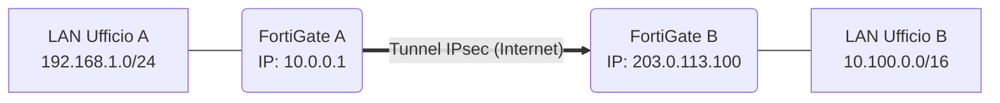
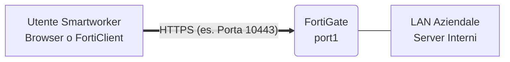

# Guida Pratica: Architettura e Troubleshooting VPN (FortiGate)

Questa è la tua "Cheat Sheet definitiva". Contiene la teoria essenziale, il significato pratico dei parametri e la risoluzione dei problemi più comuni incontrati sul campo.

---

## Obiettivo e Metodologia
**Scenario:** Configurare da zero tunnel VPN IPsec e portali SSL VPN su FortiOS.
**Metodologia:** Approccio *Hands-on*. Si usa la CLI (Command Line Interface) per forzare configurazioni e provocare errori intenzionali. Imparare a decifrare i log di debug (es. IKE) è l'unica via per diagnosticare problemi reali quando le VPN falliscono in produzione.

> [!NOTE]
> All'esame NSE4 e nel lavoro quotidiano, la teoria serve a capire *dove* guardare. La pratica ti insegna *come* correggere l'errore.

---

## 1. VPN IPsec (Site-to-Site)

Collega due reti fisiche (es. Ufficio A e Ufficio B) in modo trasparente per gli utenti. Lavora a livello di rete (Network-to-Network).

### Fase 1: IKE (Il Canale Sicuro)
Crea il canale di comunicazione cifrato iniziale tra i due firewall.

| Parametro | Descrizione Pratica | Cosa succede se sbagli |
| :--- | :--- | :--- |
| **Interface** | Interfaccia del tuo FortiGate affacciata su Internet. | Il firewall non ascolta sulla porta giusta (UDP 500). |
| **Remote Gateway** | L'IP Pubblico dell'altro firewall. | I pacchetti non sanno dove andare. |
| **Pre-Shared Key (PSK)**| La password segreta condivisa. | Errore: `possible pre-shared secret mismatch` |
| **Proposal** | Algoritmi di cifratura (es. AES) e integrità (es. SHA). | Errore: `NO_PROPOSAL_CHOSEN` |
| **IKE Version & Mode**| Main Mode (più sicuro, IP statici) o Aggressive Mode (IP dinamici). | Errore negoziazione iniziale. |

### Fase 2: Quick Mode (Il Traffico Dati)
Definisce quali reti locali sono autorizzate ad attraversare il tunnel.

> [!WARNING]
> **Subnet Speculari:** Le reti dichiarate (Local e Remote) devono combaciare esattamente a specchio tra i due firewall. Una `/24` da una parte deve essere dichiarata come `/24` dall'altra, altrimenti la VPN cade con errore `proxy id mismatch`.

### Routing e Policy
| Requisito | Scopo | Dettaglio Importante |
| :--- | :--- | :--- |
| **Rotta verso Internet** | Permette al demone IKE di trovare il Remote Gateway. | Serve una rotta di default (`0.0.0.0/0`). |
| **Rotta verso la VPN** | Inoltra i dati della LAN verso l'interfaccia virtuale VPN. | Rotta statica verso la Remote Subnet. |
| **Firewall Policy** | Autorizza il traffico ad attraversare il firewall. | **Disabilita il NAT!** I PC devono mantenere il loro IP originale. |

---

## 2. Troubleshooting IPsec (La CLI)

> [!TIP]
> I veri ingegneri non si fidano dei semafori verdi della GUI. Usa sempre i debug per leggere i messaggi del demone IKE.

**Comandi Essenziali:**
1. `diagnose debug application ike -1` (Verbosità massima)
2. `diagnose debug enable` (Mostra i log a schermo)
3. `diagnose vpn tunnel up <NOME_FASE_2>` (Forza l'avvio immediato)

### Decifrare i Sintomi
*   **Nessun log visibile:** Problema di Routing. Il firewall non sa come raggiungere l'IP remoto.
*   **Timeout & Retransmit:** Nessuna risposta dall'altro lato. IP errato, firewall spento o porta UDP 500 bloccata dal provider.
*   **`NO_PROPOSAL_CHOSEN`:** Configurazioni crittografiche (AES/SHA/DH) diverse in Fase 1 o Fase 2.
*   **`proxy id mismatch`:** Le subnet dichiarate in Fase 2 non sono speculari.

---

## 3. SSL VPN (Client-to-Site / Smartworker)

Collega un singolo utente remoto alla rete aziendale. Lavora a livello applicativo e usa la porta HTTPS.

### I 5 Pilastri della Configurazione

| Componente | Ruolo | Dettagli Tecnici |
| :--- | :--- | :--- |
| **1. User & Groups** | **L'Identità** | Mai usare i singoli utenti nelle regole. Inserisci gli utenti in un **Gruppo** per rendere la configurazione scalabile. |
| **2. SSL-VPN Portals** | **Il Cruscotto** | **Web-Mode**: Accesso via Browser (senza client). **Tunnel-Mode**: Usa FortiClient (assegna un IP virtuale aziendale al PC). |
| **3. SSL-VPN Settings** | **L'Ascolto** | Devi definire `source-interface` (dove ascoltare), `source-address` (da dove accettare, es. `all`), la porta e il `Server Certificate`. |
| **4. Authentication Rule**| **Il Cervello** | Mappa logica essenziale: *Associa un Gruppo Utenti al suo Portale dedicato*. |
| **5. Firewall Policy** | **Il Vigile** | Consente il traffico da `ssl.root` alla LAN interna. Senza questa policy, il login fallisce. |

> [!IMPORTANT]
> Se manca l'Authentication Rule, il demone della SSL VPN (`sslvpnd`) si spegne per risparmiare risorse, causando errori di connessione.

---

## 4. Gli Imprevisti Reali e i Limiti delle Licenze

La pratica sul campo nasconde insidie non menzionate nei manuali:

*   **GUI Bloccata (`Connection Lost`):** Se crei una IPsec sulla stessa interfaccia e porta (`443`) usata per l'amministrazione, IKE sequestra la porta e chiude fuori l'admin.
    *   *Soluzione CLI:* `config system global` -> `set admin-sport 8443`.
*   **Limiti Policy (Error -4):** Le licenze *Evaluation* gratuite permettono un massimo di 3 Firewall Policy totali. Oltre, il sistema dà errore.
*   **Problemi SSL VPN (ERR_CONNECTION_REFUSED):**
    *   *Errore Geografico:* Il browser punta alla porta sbagliata rispetto a dove la VPN è in ascolto.
    *   *Regola Mancante:* Il demone `sslvpnd` è morto o addormentato perché non c'è nessuna *Authentication Rule* configurata.
*   **Il Blocco Finale (Low Encryption):** Se hai configurato la SSL VPN in modo impeccabile ma la porta non si apre (`tcpsock` non la vede) e non ci sono crash log, sei vittima delle leggi sull'esportazione crittografica. Le versioni Trial "Low Encryption" bloccano l'avvio del demone `sslvpnd` in modo *hardcoded*.
